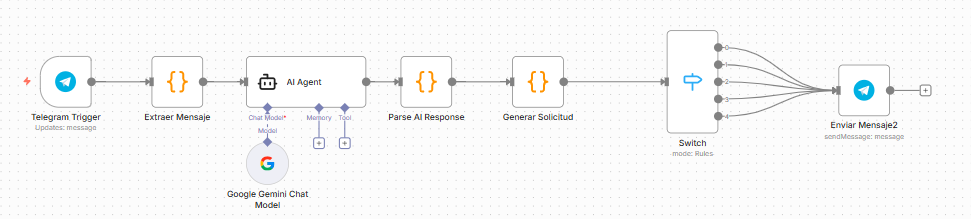

# Documentación de los diagramas del flujo n8n

Este archivo explica el flujo del chatbot académico UTEG desarrollado en n8n.

## Flujo general

1. **Telegram Trigger**
   - Nodo que recibe los mensajes enviados por los estudiantes a través de Telegram.

2. **Extraer Mensaje**
   - Nodo de tipo `Code` que extrae el texto del mensaje y el ID del chat para su posterior procesamiento.

3. **AI Agent**
   - Nodo de LangChain que analiza el mensaje del estudiante y determina la intención:
     - `saludo`
     - `consulta`
     - `iniciar_certificado`
     - `seguimiento`

4. **Parse AI Response**
   - Nodo de tipo `Code` que interpreta la respuesta del AI y genera un JSON con:
     ```json
     {
       "decision": "...",
       "tema": "...",
       "respuesta": "..."
     }
     ```

5. **Generar Solicitud**
   - Nodo de tipo `Code` que genera un certificado simulado según el tipo de solicitud del estudiante (`matricula`, `notas`, `practicas`, `no_adeudar`).

6. **Switch**
   - Nodo que redirige la respuesta según la decisión tomada por el AI.

7. **Enviar Mensaje**
   - Nodo que envía la respuesta generada de vuelta al estudiante a través de Telegram.

## Diagrama del flujo



> Nota: el diagrama "flujo-n8n.png" muestra visualmente cómo se conectan los nodos.

---

Este archivo ayuda a que cualquier desarrollador o profesor pueda **entender la lógica del flujo** sin tener que abrir n8n.
